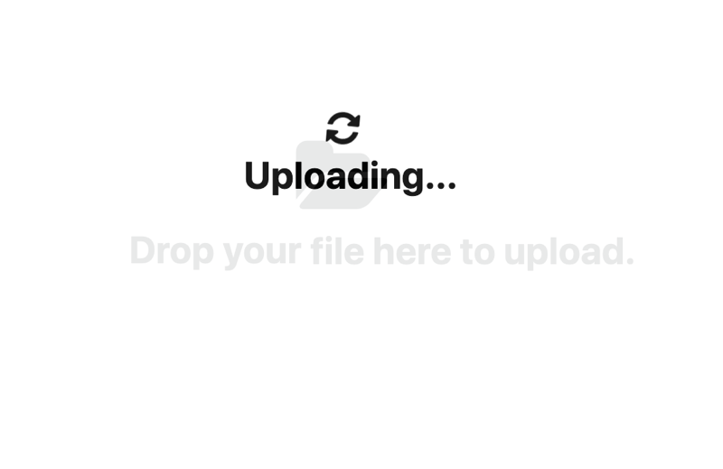

<h1 align="center">
  <br>
    
  <br>
</h1>

# Oasis Docs

Secure documents with Oasis Parcel SDK

## Why Oasis Docs?

In today's modern society, every day we hear data leakage incidents that cause huge losses in both money and trust in third parties.

So decentralized data security and privacy-first tools are really necessary.

For that reason, Oasis Docs was born.

## Features

- [x] Oasis Cloud Login
- [x] Upload your privacy-first document to Oasis Cloud by Parcel SDK
- [ ] Grant/Revoke data access with specific document to specific address
- [ ] Create/Edit/Update/Delete file

## How to use

- Access to home page: https://oasis-docs.kiendt.me


- Login with Oasis Cloud


- Upload your documents


- Uploading



- Success


- Failed


- Share with others

> _Coming Soon_

- CRUD files

> _Coming Soon_

## Development Guide

### Server

- config your environment variables in `.env`

```sh
OASIS_SERVER_CLIENT_ID='<REPLACE>'
OASIS_API_PRIVATE_KEY='<REPLACE>'
```

- install all dependencies

```sh
npm install
```

- then run server, by default server run at `http://localhost:4000`

```sh
npm run start
```

### Client

- set your backend URL at `src/constant.js`

```js
export const BACKEND_URL = 'http://localhost:4000/';
```

- install all dependencies

```sh
npm install
```

- then start your client, by default client run at `http://localhost:3000`

```sh
npm start
```

## Known issues

- I cannot find a way to oauth with Oasis Steward, so app still can not fetch all file, also cannot grant/revoke permission on your own files. At now after upload files, you must go to `https://steward.oasiscloud.io/` to interact with your files.

## LICENSE

[](./LICENSE)

© 2020 - Do Trung Kien
